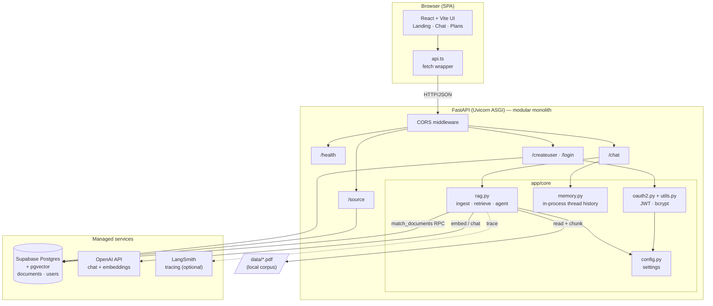
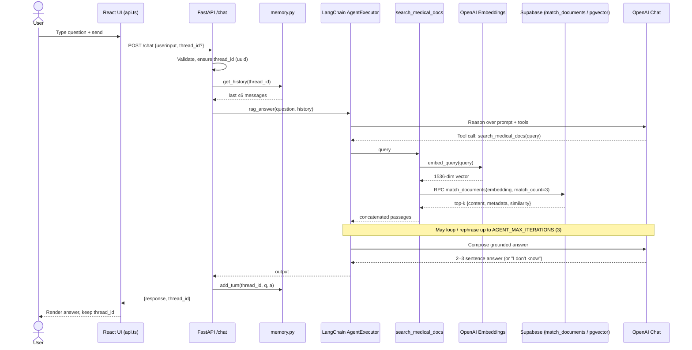
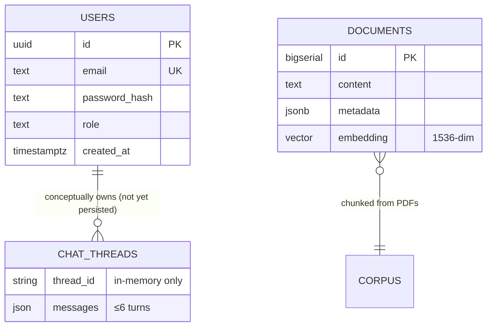
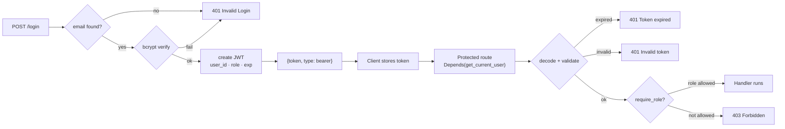

# Meridian — Project Overview & Technical Architecture

> **Grounded medical Q&A over your own documents.**
> A full-stack **agentic RAG** application: FastAPI + LangChain tool-calling agent + Supabase/pgvector retrieval + React/Vite frontend. Answers are drawn **only** from indexed PDFs, never from the model's open-world knowledge.

> **Educational use only.** Meridian is not a diagnostic tool and does not replace a licensed clinician.

**Document version:** 1.0 · Generated from the `myRAG` codebase (`app/`, `frontend/`, `scripts/`).

---

## 1. Executive Project Overview

### 1.1 Business purpose — what problem does this solve?

General-purpose LLMs (ChatGPT, Gemini, etc.) are unreliable for clinical questions: they hallucinate, mix in outdated knowledge, and cannot cite where an answer came from. Meridian solves this by constraining the model to a **curated, private corpus of medical PDFs** (drug monographs, disease references, clinical handouts). Every answer is produced by an agent that **must** call a document-search tool first; if the corpus doesn't support an answer, the assistant is instructed to say *"I don't know"* rather than guess.

In short: **Meridian turns a trusted pile of medical PDFs into a conversational, grounded Q&A assistant.**

### 1.2 Core value proposition

| Value | How Meridian delivers it |
|-------|--------------------------|
| **Trustworthy answers** | Retrieval-augmented generation restricted to indexed documents; system prompt forbids outside knowledge. |
| **Grounded & auditable** | Each chunk is embedded with a `Source: <file> \| Page: <n>` header, so provenance travels with the text. |
| **Agentic, not naive** | The LLM decides *when* and *how many times* to search, and can rephrase or multi-query for multi-part questions. |
| **Refusal by design** | Explicit "if unsupported, say I don't know" instruction reduces confident hallucination. |
| **Clinician-friendly UX** | React chat UI with a knowledge-base panel, thread memory, and a persistent "not medical advice" disclaimer. |

### 1.3 Target users

- **Primary:** Clinicians, pharmacists, and medical students who want fast, source-grounded lookups over a controlled document set.
- **Secondary:** Health-tech teams that need a template for a compliant, private-corpus RAG assistant.
- **Tertiary (current reality):** The author, as a portfolio project demonstrating production RAG + agent + auth engineering.

### 1.4 Key business goals & metrics

| Goal | Representative metric |
|------|-----------------------|
| Answer only from sources | % of answers with a supporting retrieved chunk; hallucination rate on an eval set |
| Correct refusal | % of out-of-corpus questions answered with "I don't know" |
| Retrieval quality | Recall@k / precision@k against a labeled Q→page set |
| Responsiveness | p50 / p95 end-to-end `/chat` latency; tokens per turn |
| Cost control | Average OpenAI cost per turn (chat + embeddings) |
| Reliability | Ingestion success rate; API uptime; `/health` availability |

---

## 2. Core System Architecture

### 2.1 Architectural pattern

Meridian is a **modular monolith backend** (a single FastAPI application, internally split into `core/`, `routers/`, `schemas/`) paired with a **decoupled SPA frontend** and **managed cloud data services**. It is not microservices — all backend capability runs in one deployable process — but the code is layered cleanly enough to split later.

- **Backend:** one FastAPI/ASGI app, layered (routing → core services → external clients).
- **Frontend:** independent React/Vite single-page app, talks to the API over HTTP/JSON.
- **Data / AI:** externalized to managed services (Supabase Postgres + pgvector, OpenAI, optional LangSmith).

### 2.2 Technology stack breakdown

| Layer | Technology | Notes / evidence |
|-------|-----------|------------------|
| **Language (backend)** | Python **3.12+** | `pyproject.toml` `requires-python = ">=3.12"` |
| **Web framework** | **FastAPI** (`fastapi[all]`) + **Uvicorn** ASGI server | `app/main.py`, `uvicorn app.main:app` |
| **Config** | `pydantic-settings` (`BaseSettings`) loading `.env` | `app/core/config.py` |
| **RAG orchestration** | **LangChain 1.x** + `langchain-classic` (AgentExecutor, tool-calling agent) | `app/core/rag.py` |
| **LLM** | OpenAI chat model via `langchain-openai` `ChatOpenAI` (`temperature=0.2`) | model from `OPENAI_CHAT_MODEL` |
| **Embeddings** | OpenAI `text-embedding-3-small` (**1536-dim**) via `OpenAIEmbeddings` | `vector(1536)` in `setup_supabase.sql` |
| **PDF parsing** | `PyMuPDFLoader` (`pymupdf`) | `load_pdf_chunks()` |
| **Chunking** | `RecursiveCharacterTextSplitter` (1800 chars, 150 overlap) | `CHUNK_CHARS`, `CHUNK_OVERLAP` |
| **Vector DB** | **Supabase** (managed Postgres) + **pgvector**, HNSW index | `scripts/setup_supabase.sql`, `enable_hnsw.sql` |
| **DB access** | `supabase-py` client (PostgREST) + custom RPC | `get_supabase()`, `match_documents` |
| **Auth** | `passlib[bcrypt]` (pinned `bcrypt<4.1`) + **PyJWT** (HS256), `HTTPBearer` | `app/core/utils.py`, `app/core/oauth2.py` |
| **Observability** | **LangSmith** tracing (`@traceable`, `LANGCHAIN_TRACING_V2`) | `app/core/rag.py`, config |
| **Frontend** | **React 19** + **Vite 8** + **TypeScript 6** + `react-router-dom` 7 | `frontend/package.json` |
| **Frontend lint** | `oxlint` | `frontend/package.json` |
| **Package mgmt** | `uv` (lockfile `uv.lock`) + `requirements.txt` | repo root |
| **Hosting (target)** | API on Railway/Render/Fly; frontend on Vercel/Netlify; DB on Supabase | `README.md` deploy notes |

### 2.3 Component diagram



**Interaction summary:**
- The **frontend** only knows three endpoints today (`/chat`, `/source`, `/health` — see `api.ts` and the Vite proxy). Auth endpoints exist on the backend but are not yet wired into the UI.
- The **API** delegates all AI work to `core/rag.py`, all conversation state to `core/memory.py`, and all identity to `core/oauth2.py` + `core/utils.py`.
- **Supabase** is the single source of truth for both vectors (`documents`) and identities (`users`).
- **OpenAI** is called twice in a turn class: to embed the query and to run the chat/agent.

---

## 3. Detailed Technical Data & Process Flow

### 3.1 Primary user journeys & background processes

#### Journey A — Ask a medical question (`POST /chat`)
1. User types a question in the React Chat page; `sendChat()` posts `{ userinput, thread_id }`.
2. `chat` router validates non-empty input, generates a `thread_id` (UUID) if none supplied.
3. `get_history(thread_id)` returns the last ≤6 messages from the in-process store.
4. `rag_answer()` runs the tool-calling agent (details in 3.2).
5. `add_turn()` appends the user + assistant messages and truncates to `MAX_TURNS`.
6. Response `{ response, thread_id }` returns; the UI stores `thread_id` for follow-ups.

#### Journey B — First-request ingestion (lazy background process)
- On the first retrieval, `get_retriever()` computes a **signature** of `data/*.pdf` (name + size).
- If the signature changed (or retriever is cold), `ingest()` runs: it lists already-indexed filenames from Supabase, and for each **new** PDF: loads pages → adds `source/filename/topic` metadata → splits into chunks → prepends a `Source | Page | Topic` header to each chunk → embeds → uploads in batches with retry/backoff.
- Partial-failure cleanup: if upload fails mid-file, `delete_file_rows()` removes that file's rows to avoid a half-indexed document.

#### Journey C — Account creation & login (`/createuser`, `/login`)
- `create_user`: rejects duplicate email (409), bcrypt-hashes the password, inserts `{email, password_hash, role: "Explorer"}`, returns `{email, role}` (201).
- `login`: looks up the user by email, verifies the password hash, and returns a JWT `{token, type: "bearer"}` carrying `user_id`, `role`, and `exp`.

#### Journey D — Knowledge base panel (`GET /source`)
- Returns the distinct set of indexed filenames (derived from `documents.metadata.source`) for display in the Chat sidebar.

### 3.2 Data flow mapping (client → model/DB → client)

```
[User question]
   → React api.ts (fetch POST /chat)
      → FastAPI chat router (validate, thread_id)
         → memory.get_history(thread_id)            (in-process)
         → rag_answer(question, history)
            → AgentExecutor (LLM reasons)
               → tool: search_medical_docs(query)
                  → retrieve_docs → retriever.invoke
                     → OpenAIEmbeddings.embed_query   (OpenAI)
                     → Supabase RPC match_documents    (pgvector / HNSW)
                        ← top-k {content, metadata, similarity}
                  ← concatenated raw passages
               → (LLM may loop / re-query up to AGENT_MAX_ITERATIONS)
               → final grounded answer (2–3 sentences)
         → memory.add_turn(thread_id, q, a)
   ← {response, thread_id}
→ React renders assistant bubble; stores thread_id
```

### 3.3 Sequence diagram — core `/chat` loop



---

## 4. Database & Storage Schema

Meridian uses **one Supabase Postgres instance** for two concerns: vector documents and user identities.

### 4.1 `documents` — vector store (LangChain `SupabaseVectorStore` shape)

| Column | Type | Purpose |
|--------|------|---------|
| `id` | `bigserial` PK | Row identity |
| `content` | `text` | Chunk text **including** the `Source \| Page \| Topic` header |
| `metadata` | `jsonb` | `{ source, filename, topic, page, raw_text, context }` |
| `embedding` | `vector(1536)` | `text-embedding-3-small` vector |

**Retrieval RPC — `match_documents(query_embedding, match_count, filter)`**
- Returns `id, content, metadata, similarity` where `similarity = 1 - (embedding <=> query_embedding)` (cosine).
- Applies `where metadata @> filter` for optional metadata filtering and a real `LIMIT match_count`.
- The custom `FastSupabaseVectorStore` passes `match_count` **into** the RPC so Postgres never sorts the whole table for every query.

### 4.2 `users` — identities for JWT auth

| Column | Type | Purpose |
|--------|------|---------|
| `id` | `uuid` PK (`gen_random_uuid()`) | User identity, embedded in JWT `user_id` |
| `email` | `text unique not null` | Login identifier |
| `password_hash` | `text not null` | bcrypt hash (never plaintext) |
| `created_at` | `timestamptz default now()` | Audit timestamp |
| `role` | `text` | Authorization role (**used by app code; see debt note 5.3**) |

### 4.3 Entity relationships



> **Note:** `CHAT_THREADS` is shown for clarity but is **not** a database table today — conversation memory lives in a process-local dict (`app/core/memory.py`) and is lost on restart. There is no FK relationship between `users` and either data set yet.

### 4.4 Indexing, caching & persistence strategies

| Concern | Strategy | Where |
|---------|----------|-------|
| **Vector ANN index** | **HNSW** on `embedding` with `vector_cosine_ops`, `m = 16`, `ef_construction = 64` | `enable_hnsw.sql`, `setup_supabase.sql` |
| **Users lookup** | B-tree index on `email` | `create_users_table.sql` |
| **App-object caching** | `@lru_cache` on `get_supabase()`, `get_llm()`, `get_embeddings()`, `get_agent_executor()` | `rag.py` |
| **Retriever caching** | Module-level `_retriever` reused until the PDF signature changes | `get_retriever()` |
| **Conversation cache** | In-process dict, last 6 messages per `thread_id` | `memory.py` |
| **Embed/upload batching** | `EMBED_BATCH = 256`, `UPLOAD_BATCH = 40`, adaptive shrink + retry on timeout (`57014`) | `upload_chunks()` |
| **Durable persistence** | Supabase Postgres for vectors + users | Supabase |

---

## 5. Technical Decisions, Trade-offs & Constraints

### 5.1 Why this stack (vs alternatives)

| Decision | Chosen | Alternatives considered | Rationale |
|----------|--------|-------------------------|-----------|
| **Vector store** | Supabase + pgvector | Pinecone, Chroma, Weaviate | One managed Postgres for vectors **and** users; no extra vendor; SQL-native filtering; free tier friendly. |
| **RAG style** | Agentic (tool-calling) RAG | Naive retrieve-then-answer | Agent can multi-query and rephrase for multi-part clinical questions and judge relevance before answering. |
| **ANN index** | HNSW | IVFFlat, brute force | Better recall/latency trade-off for a growing medical corpus without retraining lists. |
| **Embeddings** | `text-embedding-3-small` (1536-d) | `-3-large`, OSS models | Cheapest OpenAI option with strong quality; keeps per-turn cost low. |
| **Backend** | FastAPI monolith | Flask, Django, microservices | Async ASGI, first-class Pydantic, auto OpenAPI docs; monolith keeps ops simple for a solo/early-stage project. |
| **Auth** | Custom JWT + bcrypt | Supabase Auth, Auth0 | Full control and a deliberate learning exercise; can migrate to Supabase Auth later. |
| **Frontend** | React 19 + Vite | Next.js, CRA | Fast dev server, simple SPA; no SSR needs for a chat tool. |
| **Custom `FastSupabaseVectorStore`** | Push `match_count` into RPC | Default LangChain store | Avoids full-table sort per query — a real performance fix on larger corpora. |

### 5.2 Known limitations & scaling bottlenecks

- **Conversation memory is in-process and volatile.** `memory.py` uses a module-level dict; it is lost on restart and **not shared across multiple Uvicorn workers/replicas**, so horizontal scaling will fragment or drop history. Needs Redis/Postgres-backed sessions before multi-worker deploy.
- **Lazy, synchronous ingestion on the request path.** The first `/chat` after a corpus change triggers chunk/embed/upload inside the request, causing a cold-start latency spike. Large PDFs should move to a background worker/queue.
- **`@lru_cache`d agent executor.** Convenient, but caches a single agent instance for the process lifetime; combined with in-memory history this ties the design to a single process.
- **Vector-only retrieval.** No hybrid (keyword + vector) search or reranking yet, so exact drug names, dosages, and acronyms can be under-retrieved.
- **No streaming.** The UI's "Searching… / Drafting…" status is a **timed animation**, not real backend token/tool events.
- **CORS is wide open** (`allow_origins=["*"]`) — acceptable in dev, must be locked to the frontend origin before production.

### 5.3 Technical debt to watch

- **Schema/code mismatch on `role`.** `app/routers/users.py` inserts and selects a `role` column, and `create_users_table.sql` documents it, but a fresh run of the minimal script must include `role` or inserts/logins will fail. Treat `role` as a required column and keep the migration in lockstep with the code.
- **Settings typo:** `SECERET_KEY` (misspelled) in `config.py`/`oauth2.py`. It works because it's consistent, but it's a rename waiting to happen and a footgun for new contributors.
- **Auth not yet enforced.** `/chat` and `/source` have **no** `Depends(get_current_user)`; `require_role` exists but isn't applied to any route, and the frontend never sends a token. Role-based access control is built but not wired end-to-end.
- **Legacy agent API.** `langchain-classic` `AgentExecutor` + `create_tool_calling_agent` is the older pattern; the roadmap is to migrate to LangChain v1 `create_agent` (LangGraph runtime).
- **Secret-key DB access bypasses RLS.** The backend uses the Supabase **secret/service** key, so Row-Level Security is bypassed; all authorization must be enforced in application code.

---

## 6. Security, Compliance & DevOps

### 6.1 Authentication & authorization



- **Password hashing:** `passlib` `CryptContext` with **bcrypt**, pinned to `bcrypt<4.1` to avoid the 72-byte/version incompatibility in bcrypt 5.x. Passwords are hashed on signup and verified with `pwd.verify(plain, hash)`.
- **Tokens:** **PyJWT**, **HS256**, signed with `SECERET_KEY`; payload carries `user_id`, `role`, and `exp` (from `ACCESS_TOKEN_EXPIRE` minutes). Passwords/hashes are never placed in the token.
- **Extraction & guards:** `HTTPBearer` dependency → `decode_access_token` → `get_current_user` (rejects expired/invalid/missing-claim tokens with 401). `require_role("Explorer", ...)` adds RBAC (403 on mismatch).
- **RBAC model:** roles `Explorer` (default at signup), `Practitioner`, `Institution` (per schema comment). Server assigns `Explorer` on signup — clients cannot self-assign a role (a deliberate privilege-escalation guard).
- **Current gap (see 5.3):** RBAC is implemented but not attached to `/chat`/`/source`, and the SPA does not yet send the token.

### 6.2 Compliance posture (medical context)

- **Grounding & refusal:** system prompt forbids outside knowledge and instructs "I don't know" when unsupported — reduces harmful hallucination.
- **Sensitive-data guard:** the agent prompt explicitly forbids revealing emails, SSNs, or passwords in answers.
- **Disclaimers:** UI shows a persistent "Not medical advice" note; README labels the project educational/non-diagnostic.
- **Data residency:** documents and users live in Supabase (Postgres). Because the backend uses the service key, **all access control is application-enforced** — a compliance consideration if handling real PHI (would require RLS, auditing, and BAAs before any real-patient use).

### 6.3 Deployment pipeline & environment management

- **Runtime:** `uvicorn app.main:app` (ASGI). Target hosting: API on Railway/Render/Fly, frontend on Vercel/Netlify, DB already on Supabase (`README.md`).
- **Environments / secrets:** `pydantic-settings` loads a root `.env` (`OPENAI_*`, `SUPABASE_*`, `LANGCHAIN_*`, `SECERET_KEY`, `ALGORITHM`, `ACCESS_TOKEN_EXPIRE`, `decoder`). Secrets are injected via host env vars in production — never baked into images.
- **Frontend config:** `VITE_API_URL` selects the API origin; a Vite dev proxy forwards `/chat`, `/source`, `/health` to `127.0.0.1:8000` in development.
- **Database migrations:** SQL scripts in `scripts/` are run in the Supabase SQL Editor: `setup_supabase.sql` (extension + `documents` + RPC + HNSW), `enable_hnsw.sql`, `fix_vector_search.sql`, `create_users_table.sql`.
- **Dependency management:** `uv` with `uv.lock` (reproducible installs) plus a `requirements.txt` fallback.
- **Roadmap (not yet implemented):** Dockerfile + Compose for API/frontend, CI smoke/load tests against `/health` + one chat request, and GitHub Actions — planned per the learning roadmap; there is **no** CI/CD or IaC in the repo today.

### 6.4 Monitoring, logging & error handling

| Concern | Current state |
|---------|---------------|
| **Tracing** | LangSmith via `@traceable` on `retrieve_docs`, `rag_answer` (+ `LANGCHAIN_TRACING_V2`). Captures the agent/tool loop for debugging and latency/cost inspection. |
| **Health** | `GET /health` → `{ "Status": "Ok" }`; the UI polls it to show an online/connecting indicator. |
| **API errors** | Explicit `HTTPException`s: 400 (empty question), 500 (generation failure), 404 (no sources), 409 (duplicate email), 401 (bad login/token), 403 (role). |
| **Ingestion logging** | `print`-based progress: page counts, chunk counts, upload progress, timeout retries, and partial-failure cleanup instructions. |
| **Gaps** | No structured/JSON logging, no metrics/alerting, no request audit log (question → sources → model → latency → refusal). These are on the hardening roadmap. |

---

## Appendix A — API surface (as implemented)

| Method | Path | Auth | Request | Response |
|--------|------|------|---------|----------|
| `GET` | `/health` | none | — | `{ "Status": "Ok" }` |
| `GET` | `/root` | none | — | `{ "Message": "WELCOME" }` |
| `POST` | `/chat` | none *(planned: JWT)* | `{ userinput, thread_id? }` | `{ response, thread_id }` |
| `GET` | `/source` | none | — | `{ sources: string[] }` |
| `POST` | `/createuser` | none | `{ email, password }` | `{ email, role }` (201) |
| `POST` | `/login` | none | `{ email, password }` | `{ token, type }` (200) |

## Appendix B — Key tunable constants (`app/core/rag.py`)

| Constant | Value | Meaning |
|----------|-------|---------|
| `CHUNK_CHARS` | 1800 | Target chunk size (characters) |
| `CHUNK_OVERLAP` | 150 | Overlap between chunks |
| `UPLOAD_BATCH` | 40 | Rows per Supabase upload batch (adaptive shrink to 10 on timeout) |
| `EMBED_BATCH` | 256 | Embedding batch size |
| `TOP_RESULTS` | 3 | Chunks returned per tool search (`k`) |
| `MAX_RETRIES` | 4 | Upload retry attempts on timeout |
| `AGENT_MAX_ITERATIONS` | 3 | Max agent tool-call loops per question |

## Appendix C — Repository layout

```text
myRAG/
├── app/
│   ├── main.py                 # FastAPI app, router wiring, CORS
│   ├── core/
│   │   ├── rag.py              # ingest · retrieve · tool-calling agent
│   │   ├── memory.py           # in-process thread history (≤6 turns)
│   │   ├── oauth2.py           # JWT create/decode, get_current_user, require_role
│   │   ├── utils.py            # bcrypt hash/verify
│   │   └── config.py           # pydantic-settings from .env
│   ├── routers/                # health · chat · sources · users
│   └── schemas/                # Pydantic request/response models
├── frontend/                   # React 19 + Vite + TS SPA (Landing/Chat/Plans)
├── scripts/                    # Supabase SQL: setup, HNSW, fix, users
├── data/                       # local PDF corpus (gitignored)
├── pyproject.toml / uv.lock    # Python deps
└── README.md
```
